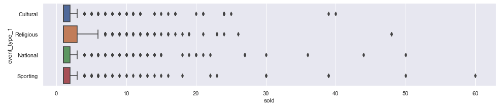

# What holidays should Walmart promote hobby items?
Analize Data to determine what would be great holidays to add items related to hobbies for holiday promotion. 
Gave insite, conclusion and next stepts in order 

## [Index](https://github.com/nanthalec/Walmart/blob/master/Walmart%20final.ipynb)
## Import
## Clean Data
## Take a Sample
## Analysis of Data
## Visual
## Statistical Test
### -  First F-test
### -  Second F-test





From above visuals we can see Religious items sold more than any other catergory. Lets test it

Hyp: Religious sell more than other event type

HO: Religious dont sell more than other event type
```
b_data = {grp:df_hs['sold'][df_hs.event_type_1 == grp] for grp in grps}
F, r = stats.f_oneway(b_data['National'], b_data['Cultural'], b_data['Sporting'], b_data['Religious'])

if r <0.05:
    print("reject null hypothesis")
else:
    print("fail to reject null hypothesis")
```


# Background
Walmart Data was pulled from Kaggle.
Data is from 2011 to 2016 over 3 states and 10 stores total
Determined what were the best holiday for promotion over all, was the best holidays over all, what promo type was profitable, and finally, which holidays in the number one prom type works would be profitable